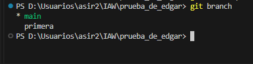

# Ejercicio 3

## Creación de la rama "primera"

Para crear la rama llamada "primera" en mi repositorio local, ejecuté el siguiente comando:

```bash
git checkout primera
```


## Después, para comprobar que la rama fue creada, usé el comando:
```bash
git branch
```



La salida mostró las siguientes ramas, confirmando que "primera" ha sido creada y estoy trabajando en ella:

* primera
  main
  
## Creación y fusión de un fichero en la rama "primera"
En la rama "primera", creé un nuevo fichero llamado nuevo_fichero.txt y luego fusioné la rama con la rama principal (main). Utilicé los siguientes comandos para realizar la fusión:

```bash

git checkout main
git merge primera
```


**¿Se ha producido conflicto?**
No, no se ha producido conflicto. Esto se debe a que no se realizaron cambios simultáneos en los mismos archivos en ambas ramas. Al añadir un nuevo archivo en la rama "primera" y luego fusionarlo con main, Git pudo fusionar las ramas sin problemas.

**Borrado de la rama "primera"**
Después de la fusión, borré la rama "primera" con el siguiente comando:

```bash

git branch -d primera
```


**Creación de la rama "segunda" y generación de un conflicto**
Para generar un conflicto, creé una nueva rama llamada "segunda":

```bash

git checkout segunda
```


Modifiqué el fichero conflicto.txt en la rama "segunda" y luego intenté fusionar la rama "segunda" con la rama main, lo que generó un conflicto:

```bash

git checkout main
git merge segunda
```


**Conflicto generado en el archivo conflicto.txt**
A continuación, presento el contenido del archivo conflicto.txt donde ocurrió el conflicto:


**Solución del conflicto**

Para solucionar el conflicto, edité el archivo conflicto.txt para combinar los cambios de ambas ramas. Aquí está el contenido del archivo después de la resolución del conflicto:

Este es el contenido combinado de la rama main y la rama segunda.
Una vez solucionado el conflicto, ejecuté los siguientes comandos para completar la fusión:

```bash

git add conflicto.txt
git commit
git push origin segunda
```


**Captura de pantalla de la rama "segunda" sincronizada en el remoto**

He sincronizado la rama "segunda" con el repositorio remoto en GitHub. A continuación, adjunto una captura de pantalla donde se muestra la rama "segunda" creada en el repositorio de GitHub.


