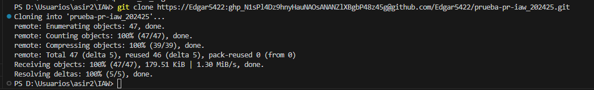
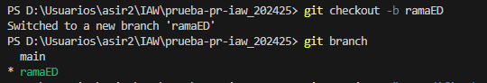
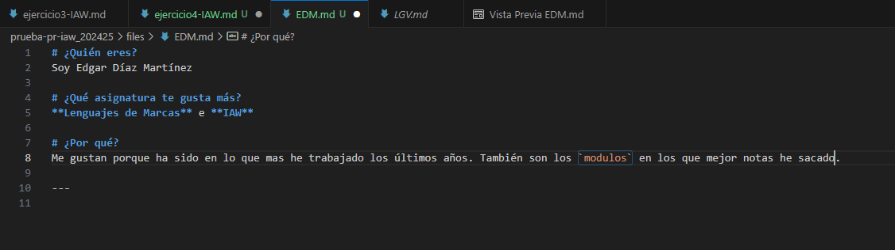
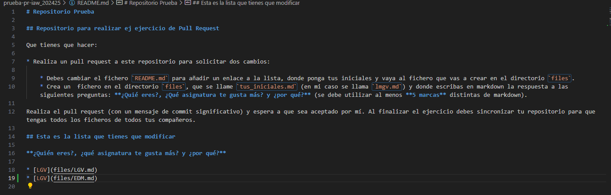
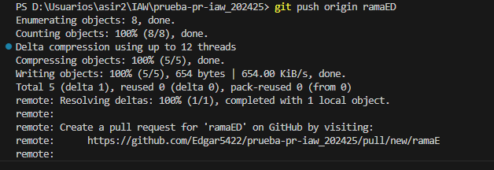

# Ejercicio 4:

## Instrucciones para realizar un Pull Request (PR)

A continuación, se detallan los pasos fundamentales para realizar un **Pull Request** (PR) desde una rama de trabajo hacia la rama principal (`main`), utilizando Git y GitHub.

## 1. Clonar el repositorio (si no lo has hecho ya)

Si todavía no tienes el repositorio en tu máquina local, debes clonarlo. Abre la terminal y ejecuta:

```bash
git clone https://github.com/tu-usuario/prueba_tu_nombre.git
```


Una vez hecho eso creamos una nueva rama:



## 3. Realiza los cambios necesarios

Haz los cambios que deseas realizar en tu repositorio local, ya sea modificando o agregando archivos. Para este ejercicio, puedes modificar o crear nuevos ficheros en el repositorio.



Y añado mi enlace al README:



## 4. Añadir y confirmar los cambios

Después de realizar tus cambios, añádelos al área de preparación (staging) y confírmalos (commit) con un mensaje descriptivo:

```bash
git add .
git commit -m "Descripción de los cambios realizados"
```


## 5. Subir los cambios al repositorio remoto

Sube la nueva rama con los cambios al repositorio remoto en GitHub:

```bash
git push origin nombre_de_tu_rama
```


## 6. Crear un Pull Request (PR) en GitHub

- Ve al repositorio en GitHub.
- Verás una notificación con el botón "Compare & pull request" cuando subas tu nueva rama. Haz clic en él.
- En la página del Pull Request:
- Revisa que la rama base sea main y la rama de comparación sea nombre_de_tu_rama.
    - Añade un título y descripción clara sobre los cambios que has realizado.
    - Haz clic en "Create pull request".

